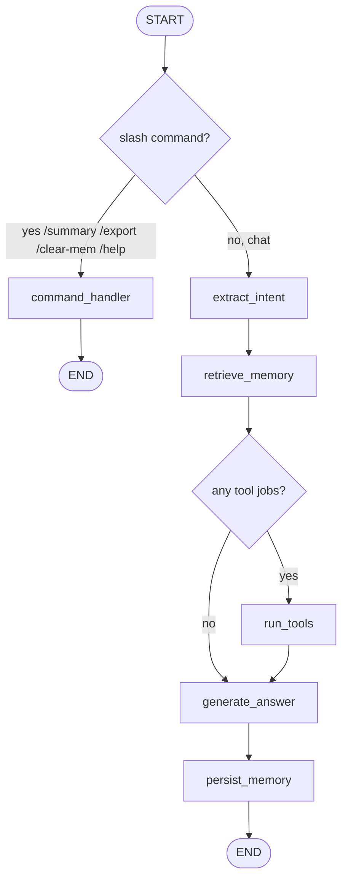

# Harvey

Harvey is a **financial research agent** that runs in the terminal. You ask a question about stocks, news, earnings, or SEC filings. It extracts *why* you asked, fetches only the data that matches that intent, answers from that data, and stores the turn as an **intent-tagged memory** instead of dumping everything into a vector store.

The design follows [Grounding Agent Memory in Contextual Intent (STITCH)](https://arxiv.org/abs/2601.10702). Similar-looking facts about the same ticker can belong to different research goals (AAPL as a long-term compounder vs AAPL as a short-term risk case). Harvey indexes each turn by a contextual intent tuple so later retrieval can prefer compatible history.

```
you type a question
        │
        ▼
 Rich TUI  ──events──►  LangGraph  ──tools──►  Alpha Vantage / SEC EDGAR
        ▲                    │
        └──── traces, answer, memory ────────┘
```

It is not a trading bot, not a general chatbot, and not embedding-only RAG. Numbers (prices, EPS, filing dates) must come from tools. The LLM parses intent and summarizes tool output; it is not allowed to invent live market data.

---

## What it can do

Ask in natural language. One sentence can trigger several tools at once (`AAPL price and latest news`).

| You ask | Intent | What runs |
|---|---|---|
| “What’s AAPL trading at?” | `data_request` | Live price (Alpha Vantage `GLOBAL_QUOTE`) |
| “Latest news on MSFT” / “AAPL news last week” | `news_request` | News + sentiment (Alpha Vantage `NEWS_SENTIMENT`) |
| “TSLA diluted EPS” | `earnings_request` | Most recent diluted EPS from SEC company facts |
| “Recent 10-K / 10-Q for AMZN” | `filing_request` | Latest SEC submission list |
| “Is this a good long-term hold?” | `financial_query` | LLM only — no live numbers invented |
| “Hello” | `greeting` | Conversational reply |

Slash commands: `/summary`, `/export`, `/clear-mem`, `/help`, `/quit`.

Research mode (Tab): `long-term` → `short-term` → `risk` → `macro`. Shown on the status line; not yet a hard gate on retrieval.

---

## Architecture

```
harvey/
├── cli/                 # Rich TUI (input, traces, colors, keys)
├── graph/               # LangGraph compile + nodes
│   ├── graph.py         # topology
│   ├── state.py         # HarveyState
│   ├── run.py           # one-turn ainvoke + emit callback
│   ├── events.py        # UiEvent protocol
│   └── nodes/           # parse, extract, retrieve, tools, generate, persist
├── tools/               # Alpha Vantage + SEC HTTP
├── memory/              # JSON STITCH store + retriever
├── prompts/             # intent extraction + answer prompts
└── llm.py               # Gemini via langchain-google-genai
```

Two processes of thought, one process at runtime:

1. **TUI** (`harvey/cli`) owns the screen and keyboard. It never calls APIs.
2. **Graph** (`harvey/graph`) owns the turn. Nodes push `UiEvent`s through an `emit` callback so the TUI can draw tool trees while work is still running.

`python -m harvey` starts the TUI. On Enter, a background thread calls `run_live_turn()`, which `asyncio.run`s `graph.ainvoke(...)`.

---

## The agent graph

Every user turn is **one pass** through a compiled LangGraph `StateGraph`. There is no ReAct loop and no LLM tool-calling. Routing is schema-driven: extracted intent labels map 1:1 to tools.



Shared state is `HarveyState` (`harvey/graph/state.py`). Each node returns a **partial dict** of fields to merge. Important fields:

| Field | Role |
|---|---|
| `user_input` | Raw question |
| `previous_turn` | Last user/agent text, for pronoun resolution |
| `thematic_scope` | σ — free-text research goal |
| `intents` | ε — closed list of action labels |
| `entities` | Typed values (`STOCK_TICKER`, dates, …) |
| `retrieved_memories` | Prior snippets that overlap scope or entities |
| `tool_jobs` | Queued fetches after routing |
| `tool_results` | `{ price?, news?, earnings?, filings? }` |
| `prompt_parts` | Human-readable tool strings for the summarizer |
| `all_tool_calls` | Traces shown in the TUI |
| `response` | Final answer text |

---

### Node by node

#### 1. `parse_command`

If the line starts with `/`, store the command name (`summary`, `export`, …) and take the command branch. Otherwise `command` is `None` and the chat branch runs.

Implemented in `harvey/graph/graph.py` (inline). Slash handling itself lives in `harvey/graph/nodes/commands.py`.

#### 2. `command_handler` (command branch only)

| Command | Behavior |
|---|---|
| `/help` | Lists commands and keybinds |
| `/summary` | Asks Gemini to summarize the last ~12 memory entries |
| `/export` | Writes `memory_export_<timestamp>.json` in the current directory |
| `/clear-mem` | Empties `harvey/memory/memory.json` |
| `/quit` `/exit` `/q` | The TUI intercepts these and exits; the node is a fallback |

This branch **does not** extract intent, call market APIs, or persist a chat snippet. It goes straight to END.

#### 3. `extract_intent`

First LLM call. Gemini is asked for **structured JSON** (`ExtractedIntent` via `with_structured_output`), not free-form tool calls.

It returns:

- **thematic_scope** — e.g. `"stock price inquiry"`, `"latest news"`
- **intents** — one or more of `data_request`, `news_request`, `earnings_request`, `filing_request`, `financial_query`, `factual_question`, `greeting`, `general_conversation`, …
- **entities** — `{ type, value }`, including `STOCK_TICKER`, `DATE_FROM` / `DATE_TO` (`YYYYMMDDTHHMM`), company names, metrics

Relative dates are computed against **today**, not a frozen prompt date. Pronouns (`its` P/E) are resolved from `previous_turn`. If the model fails, the node falls back to `general_conversation` so the turn still completes.

The TUI shows: `Figuring out what to look up.`

#### 4. `retrieve_memory`

Rule-based, no embeddings yet. A stored snippet is relevant if:

- `thematic_scope` matches case-insensitively, **or**
- any entity **value** overlaps (e.g. both mention `AAPL`)

Hits are sorted oldest → newest; the last 3 go into `retrieved_memories` and later into the answer prompt.

This is a STITCH *prototype*: it stores σ and ε, but ranking is still “scope or ticker overlap,” not full label-density + embedding tie-break.

#### 5. `route_tools`

Pure function. No LLM, no HTTP.

For each intent, if a ticker is available, queue a job:

| Intent | Job `tool_name` | Extra |
|---|---|---|
| `data_request` | `fetchStockPrice` | — |
| `news_request` | `fetchNews` | date window, default last 24h UTC |
| `earnings_request` | `fetchCompanyFacts` | — |
| `filing_request` | `fetchSubmissionMetadata` | — |

Other intents queue nothing. Tickers are reused across **different** tool types in the same turn, so “AAPL price and latest news” runs both tools even if the extractor only emitted one `STOCK_TICKER`. Two price requests still consume two tickers (`AAPL` then `MSFT`).

If `tool_jobs` is empty, `run_tools` is skipped.

#### 6. `run_tools`

All jobs run concurrently (`asyncio.gather`), like `Promise.allSettled`. Each job:

1. Emits `tool_start` so the TUI can draw `• fetchStockPrice("stock price of AAPL")`
2. Calls the Python tool in `harvey/tools/`
3. Emits `tool_detail` (`└ in 1.2s`) or `tool_done` with `error`
4. Writes a prompt string into `prompt_parts` and structured data into `tool_results`

Failures do not abort the turn. The summarizer still sees the error text.

| Tool module | Source |
|---|---|
| `tools/finance.py` | Alpha Vantage `GLOBAL_QUOTE` |
| `tools/news.py` | Alpha Vantage `NEWS_SENTIMENT` (`title` / `source` / `summary`) |
| `tools/sec.py` | EDGAR CIK map, company facts (diluted EPS), submissions (recent forms) |

SEC calls send a User-Agent with contact info (required by EDGAR) and are rate-limited to ~10 req/s.

#### 7. `generate_answer`

Second LLM call — unless the turn is a **simple price**:

- exactly one intent, `data_request`, and a successful price → random English template, no Gemini

Otherwise:

- **Tools ran** → grounded system prompt: summarize **only** `prompt_parts` (+ retrieved memories). Two sections: *Summary of Information* and *Answer to the user's query*.
- **No tools** → conversational system prompt. Still must not invent live prices, EPS, or filing dates.

The TUI shows `Summarizing the data.` then the `answer` event.

#### 8. `persist_memory`

Appends a snippet to `harvey/memory/memory.json` with:

- `thematic_scope` (σ)
- `event_types` / `intents` (ε) — persisted, not dropped
- `entities` and `entity_types` (κ)
- raw `context` (tool payloads)
- `source_urls` from news when present
- `canonical_summary` (truncated answer)

Then END. The TUI keeps `previous_turn` in process memory for the next extract.

---

## Backend: TUI ↔ graph

The TUI does not import tools. It talks to the graph through a small event protocol (`harvey/graph/events.py`).

```
Enter
  → TUI thread starts worker
      → run_live_turn(query, emit, previous_turn, research_mode)
          → graph.ainvoke(state, config={emit})
              nodes call emit({type, ...})
      → worker puts events on a queue
  → Live loop drains the queue and redraws
```

| Event | When | TUI |
|---|---|---|
| `thought` | extract / generate status | green status line |
| `tool_start` | a fetch begins | `• fetchNews("latest news for AAPL")` |
| `tool_detail` | success timing | `└ in 1.2s` |
| `tool_done` | finished, optional `error` | red `FAILED` + `└ Error:` |
| `answer` | final text | mint `•` + off-white body |
| `table` | structured rows (demo / later) | green grid |
| `error` | uncaught exception | shown as the answer |

`--demo` skips the graph and replays canned `UiEvent`s (semiconductor table). Useful for layout without API keys.

The emit function is passed in LangGraph `config["configurable"]["emit"]`. Nodes pull it with `get_emit(config)` so they stay testable without a terminal.

---

## Memory (STITCH, partial)

Paper tuple: **ι_t = (σ_t, ε_t, κ_t)** — thematic scope, event type, key entity types.

Harvey stores that on every chat turn. Retrieval today is overlap of scope or entity values, last 3 hits. Not yet implemented: label-density ranking, embedding tie-break only among compatible intents, memory stitching, belief timelines, mixing-intent warnings.

---

## TUI

`python -m harvey` opens a full-screen Rich `Live` app (muted charcoal + mint).

- Home: ASCII **HARVEY**, centered input, `Build` + model + research mode
- Session: submitted query stays in the box; tool trees render **under** it; a new box appears after the answer
- Keys: Enter submit · Tab research mode · Ctrl+P commands · Ctrl+Q / Ctrl+C quit · Up/Down history

---

## Run

Python 3.11+. Create a repo-root `.env`:

```
GEMINI_API_KEY=...
ALPHA_VANTAGE_API_KEY=...
```

Optional: `HARVEY_MODEL` (default `gemini-flash-latest`), `SEC_USER_AGENT`.

```bash
python3 -m venv .venv
source .venv/bin/activate
pip install -e .

python -m harvey              # live agent
python -m harvey --demo       # canned TUI, no keys
python -m harvey --dump home  # static layout frame
```

Alpha Vantage free tiers are rate-limited; price then news in one turn can hit a `Note` / `Information` response. SEC needs a User-Agent with a contact string (already set; override with `SEC_USER_AGENT` if EDGAR returns 403).

---

## Invariants

1. Numbers come from tools, not the model.
2. Intent is extracted before any fetch.
3. Multiple intents in one sentence run in parallel.
4. Memory is intent-addressable, not a flat chat log and not embedding-only RAG.
5. Every tool, including failures, is visible in the TUI.

If a change violates (1), (2), or (4), it is no longer Harvey.

Deeper contracts, prompts, and the original STITCH gaps are in [`CONTEXT.md`](CONTEXT.md).
